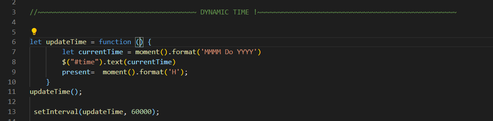
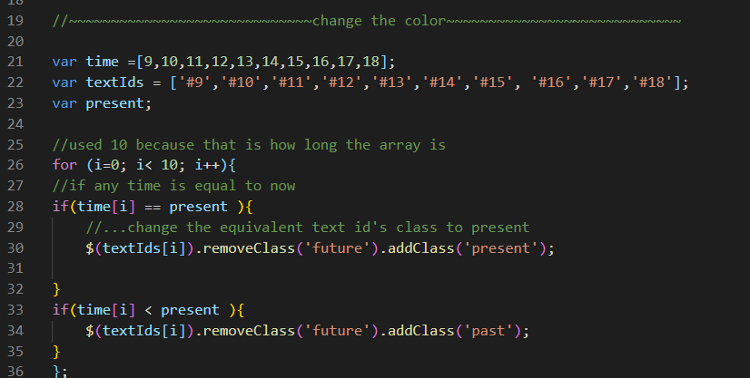

<!-- Read Me template -->

#  Work-Day-Scheduler 

### A simple calendar application that allows the user to save events for each hour of the day. This app will run in the browser and feature dynamically updated HTML and CSS powered by jQuery. 

## Table of Contents
* [Technologies Used](Technologies_Used)
* [Deployed Site](Deployed)
* [Features](Features)
* [Usage](Usage)
* [Author](Author)
* [Credits](Credits)
* [License](License)

## Technologies_Used
* HTML (42.8%)
* CSS (7.7%)
* Javascript (49.5%) -moment.js

## Deployed Site
[Work-Day-Scheduler](https://rksouth.github.io/work-day-scheduler/)

## Features 

__1.A dynamic timer that shows the current date__
 
_Why?_

A planner app that isn't at least a little dynamic is not really more useful than a peice of paper and a pen. Plus this planner is for tracking time and keeping on top of things, not for checking things off. So, having it change color with the time of day is important in order to help the user know what they should be doing at a paticular hour.

_What?/How?_

   

  I was fortunent in this project to have a template to work from. I used the site moment.js and their app example as a starting point. Then, I took at all the parts I was sure I didn't need, followed by the parts that I thought I might not need. I build my own secondary function to check my understanding before I narrowed it down to this snippet of code. 

  The first function updates the time date regularly on the screen. Even if the users forgets to close the app before they go home for the night, it will still work for them dynamically. It writes the date directly from moment.js to the html using the moment.js format. setting any variable within the update time function and setting the interval with setInterval will update it. I chose to update it once a minute, that way the user won't miss a beat. 

__2. Color changing text areas based on time__

_Why?_

One of the best ways to indicate anything in design is by use of color. Simple, dynamic and easy to understand at a glance. We don't want users having to think too hard about how the design works, we want them to use it naturally. 

_What?/How?_
	
In order to change the colors I built two arrays, one that contained a number and one that contained a string (the id's of the textbox in the html). I also created a variable that I set to extract the time from moment.js. 

Then I created a for loop that iterates through 10 (the length of the array). Inside are two if statements. one that looks at present and sees if it is equal to anything in time and another that looks into the past. I used i to further determine the matching id to the time array so that present = time = id (in miltary time). Military time is helpful here, though I don't like it other circumstances to count time as numerical basis I can add and subtract with rather than having to us pm or am as indicator to add/subtract 12. I used the removeClass before I added class to make sure there was no funny business with the class before I set it. All classes are set to future by default so it's easy just to remove the future and stick in which ever is applicable. This was also helpful during debugging late at night because if something went wrong, all the boxes turn green instead of staying gray.

__3. The ability to store data even when the page is closed__

_Why?_

This is an app to increase productivity. If you have to re-type in your daily to do list everytime your computer goes to sleep, you accidently close your browser or everyone decides to microwave their lunch at once-you can still keep track of what you have to do. If we are going to build something that can be done almost as well as pen and paper then it needs to at least have the functionality of pen and paper, that is, being permanent. 

_What?/How?_

Local storage is simply the act of storing something on the browser, or locally, instead of storing it on a server and giving others' access to it. Basically, all that needs to be done at a push of the button '$(#btn9a").on("click"), function(){' is to use localStorage.setItem and then localSotrage.getItem to put something in storage and retrieve it. 

However, I don't like my code or my readme to be messy, why would I allow that with my localStorage. So, I made sure with each click that we are both removing extra, unnecsary items from the array and the storage. I also named my storage the same name as the button so that I could easily track whether something was stored based on that button or not. All the buttons get stored in the saveArray before they get to go to localStorage.

Finally, we get to the function I built to get items, function junction.

It contains a for loop that loops through my final array, allDbtns (remember that's how I named my saved text in the storage) and sets them back into the matching id's in the html. I called function junction to happen inside of the button click and outside. Meaning, the text will be updated both when the button is clicked or when the page is reloaded. This is important if the text is blank or completely erased. 

   
    
__5. Other__

* For later builds

_Put all the buttons in 1 for loop_

 Lately I have been working to get tighter and tighter code, putting more and more in arrays, having those arrays write themselves and everything that is everything goes in a round about loop to get the computer to do the work. I wasn't able to get my for loop going for buttons this time because I wanted to take extra time to make sure I understood all the little bits of what I was coding so I want to add this here to make sure I know to go back and make it even better.

_Have most of the HTML write itself_

Just like it's possible to tightly wad the javascript into a smaller line of code, it's possbile to do that with html. Seeing as it's a simple row of columns displayed over and over it would be simple to add it into a loop. However, I feel like that would be something best done once the loops on the buttons are finished. 

_Be able to adjust whether we are looking at minuteshours/days/weeks_

Personally, I like to plan by the week, not by the hour-so being able to pick a time frame seems like a good idea to me. It might even be cool to toggle between them. Or I could expand the local storage to not remove it's previously assigned string and pull from the strings based off of different aspects of the data.

_Add a fun background_

Backgrounds are fun, there should be more of them!

  

## Usage
### This is meant for anyone that needs to make their work more efficient and cannot stand the inneficency of pen and paper. 

## Author 
Rachael Kelm-Southworth

* [linkedin] (https://www.linkedin.com/in/rachael-kelm-southworth-87a3831b3) 

* [github] (https://github.com/RKSouth/)

 ## Credits

I would like to thank Kerwin, Manuel, Roger, Jerome and all my classmates for helping me understand this subject matter and anyone that contributed to make the base code.

## License
[MIT](https://choosealicense.com/licenses/mit/)

